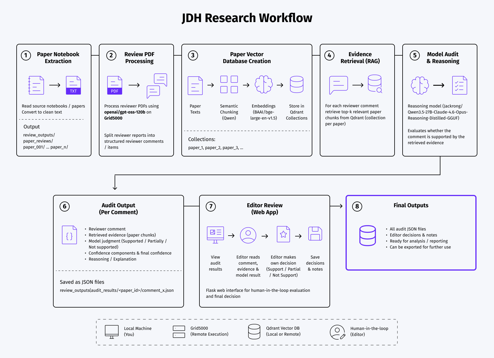
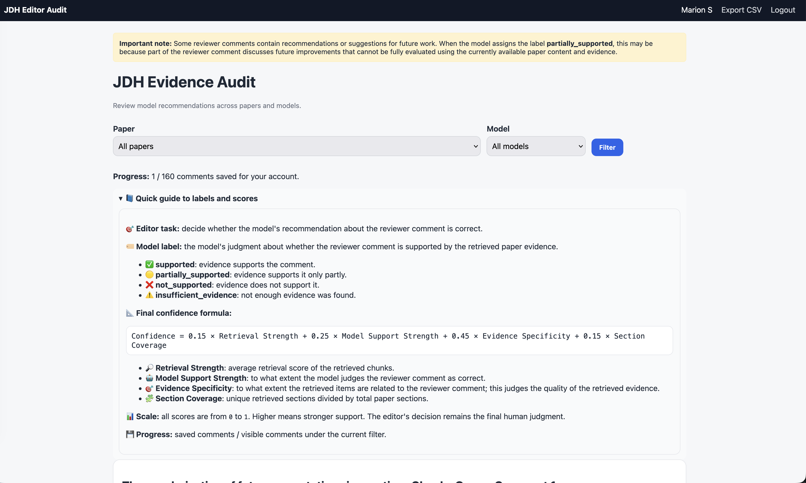
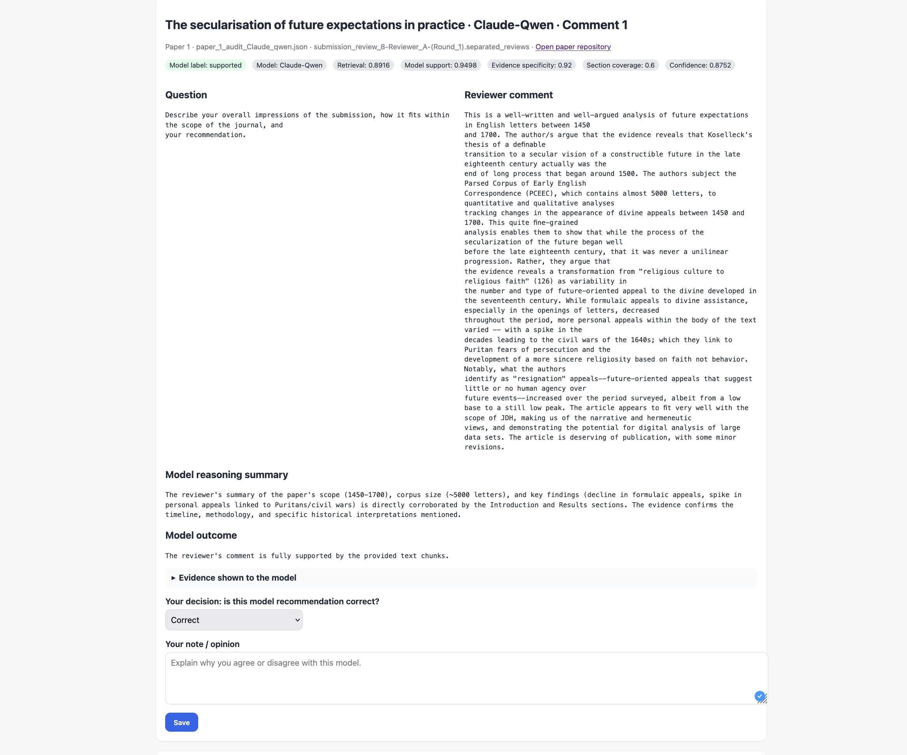
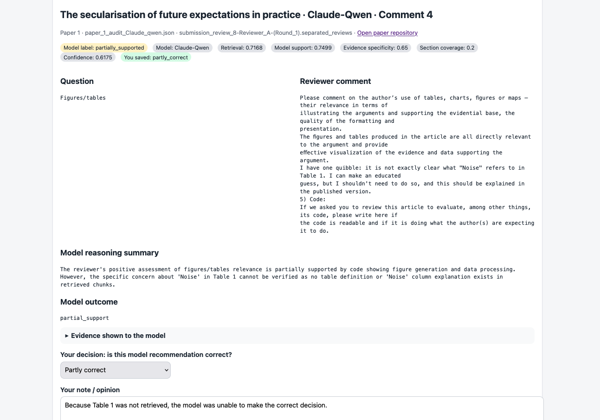
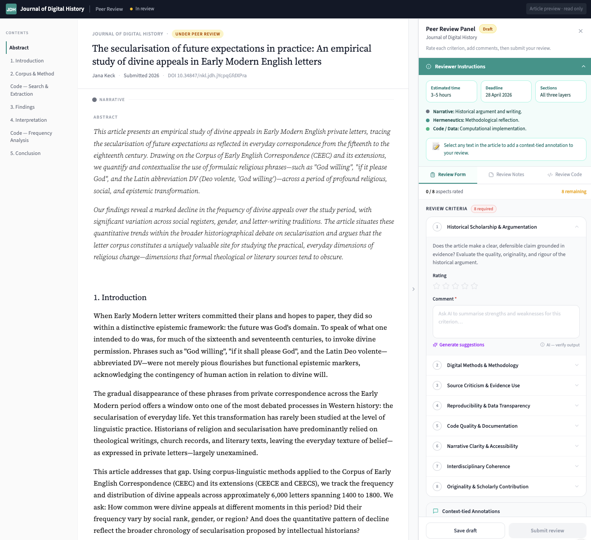

# Plan

- Introduction
- Challenges about peer review
- Evidence RAG 
- What should be the future steps ? 
- POC

::: notes 
Frédéric
:::

# Introduction

........

::: notes 
Frédéric
:::

# Challenges about peer review

.......

::: notes 
Frédéric
:::

# Evidence RAG

1. Infrastructure : Grid5000 or local model
2. Pipeline
3. JDH evidence audit application
4. Results

# Infrastructure

:::: {.columns}
::: {.column width="50%"}
**Grid5000** is a large scale and flexible testbed for experiment-driven research in all areas of computer science.
:::
::: {.column width="50%"}

:::
::::

# 

{fig-align="center"}

# JDH evidence audit app

#

#

#

# Results

#

:::: {.columns}
::: {.column width="50%"}
{}
:::
::: {.column width="50%"}
- text placeholder
- text placeholder
- text placeholder
- text placeholder
:::
::::

::: notes 
Mehrdad
:::

# 

:::: {.columns}
::: {.column width="50%"}
{}
:::
::: {.column width="50%"}
- text placeholder
- text placeholder
- text placeholder
- text placeholder
:::
::::

# 

:::: {.columns}
::: {.column width="50%"}
{}
:::
::: {.column width="50%"}
- text placeholder
- text placeholder
- text placeholder
- text placeholder
:::
::::

# 

:::: {.columns}
::: {.column width="50%"}
{}
:::
::: {.column width="50%"}
- text placeholder
- text placeholder
- text placeholder
- text placeholder
:::
::::

# What should be future steps ?

......

:::notes
:::

# Proof of Concept (POC)

#

{fig-align="center"}

:::notes
:::

# Bibliography